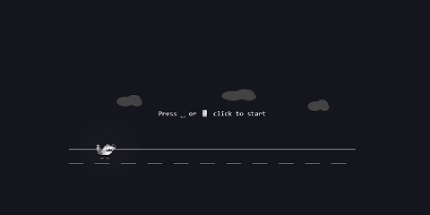
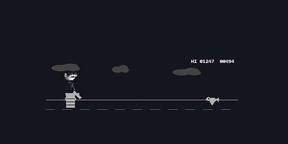

# Raccoon Game

A fun, fast-paced infinite runner built with React, TypeScript, and HTML5 Canvas.

## Preview





## Overview

Take control of a quick-footed raccoon and survive as long as you can! Dodge various obstacles like trashcans, traffic cones, bears, alligators, birds, and motorcycles. The game progressively gets faster and harder as your score increases, featuring dynamic speed milestones and a day/night cycle.

## Features

- **Infinite Runner Gameplay:** Jump and duck to avoid diverse obstacles.
- **Dynamic Difficulty:** The game speed increases at specific score milestones (500, 1000, 1500, etc.).
- **Day/Night Cycle:** The environment changes every 500 points, introducing different visuals and specialized obstacles (like fast motorcycles at night).
- **High Score Tracking:** Your best score is automatically saved locally so you can always try to beat your record.
- **Responsive & Full Screen:** The game dynamically scales to fill your browser window horizontally while maintaining its retro aesthetic.
- **Mobile Support:** The game is playable on mobile devices with touch controls.
- **Sound Effects:** The game features sound effects for jumping, when game goes faster, and motorcycles.

## Game Controls

- **Start / Restart:** Press <kbd>Space</kbd> or click the screen.
- **Jump:** <kbd>Space</kbd> / <kbd>W</kbd> / <kbd>Up Arrow</kbd>
- **Duck:** <kbd>S</kbd> / <kbd>Down Arrow</kbd>

## Technologies Used

- **React 19** for UI scaling and structure
- **TypeScript** for robust typing and maintainability
- **HTML5 Canvas** for high-performance 60fps rendering
- **Vite** for blazing fast development and building
- **Tailwind CSS** for styling
- **Framer Motion** for animations
- **p5.js** for game logic
- **next.js 16** for UI scaling and structure

## Running Locally

1. Ensure you have Node.js installed.
2. Install dependencies:
   ```
   npm install
   ```
3. Start the development server:
   ```
   npm run dev
   ```
4. Open your browser to the URL provided (default: `http://localhost:5173`).

## Building for Production

To create an optimized production build:
```
npm run build
```
The compiled files will be generated in the `dist` directory, ready to be deployed.

## Inspiration

This game reimagines the classic Chrome dinosaur game with a playful twist—featuring Ubuntu 26.04 LTS 'Resolute Raccoon' as the star.

Born from my recreation of the iconic Ubuntu 26.04 desktop environment for my portfolio, this project celebrates the raccoon's resourceful spirit through interactive fun.